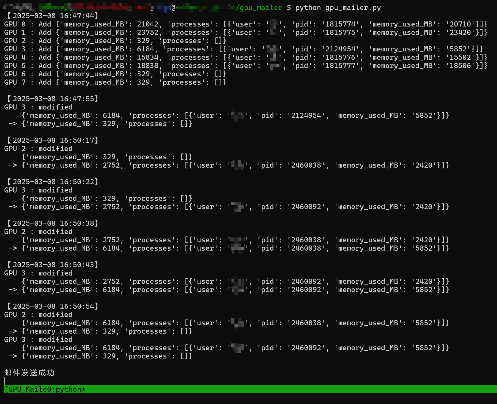
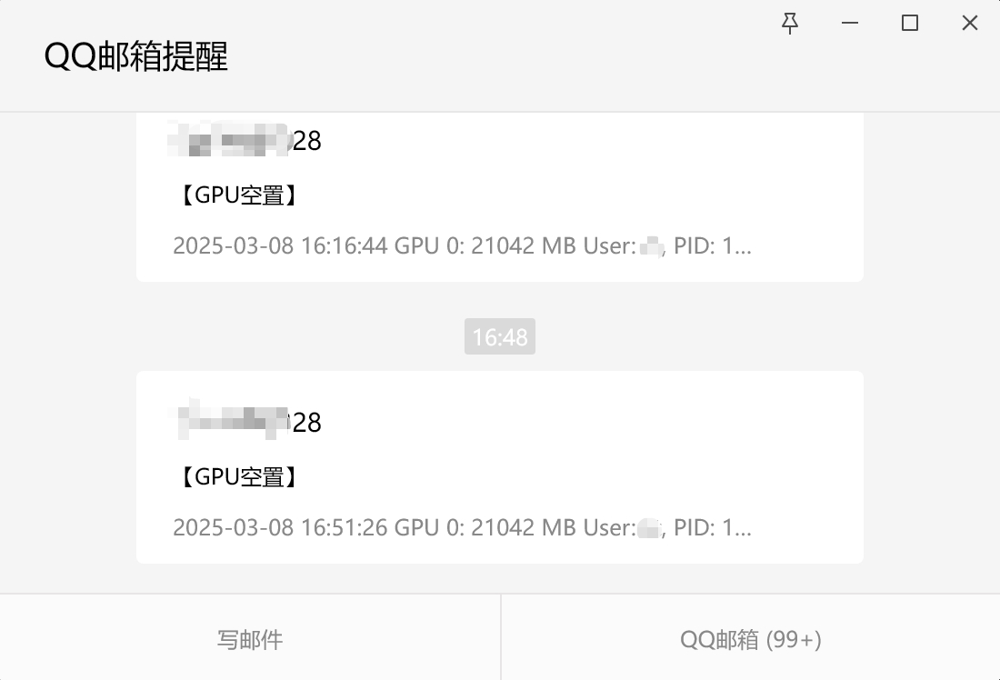

# GPU服务器显存监控/邮件提醒

用ai写的一个简单的GPU服务器监控小程序

适合多人合用GPU服务器，时常需要抢资源的场景

使用QQ邮箱，能直接推送到微信上

## 实现逻辑

- 设定显卡显存阈值（如500M）
- 每5s
  - 从gpustat里获取各个显卡的使用情况报告
  - 对比上一次获取的报告情况，输出到终端
  - 对于空闲显卡：
    - 若显卡是新的空闲显卡，记录显卡开始空闲的时间
    - 若显卡空闲满足30s：
      - 若有任意本人GPU进程，则记录需要发送邮件，清空该gpu的low_gpu
      - 若无任意本人GPU进程，则继续记录当前low_gpu
  - 对于非空闲显卡：
    - 清除low_gpu记录
  - 若需要发送邮件，则发送所有gpu的使用信息

## 实现效果
</img>
</img>

## get start
1. `git clone git@github.com:MrHandsomeljn/GPU-Mailer.git`
2. `cd gpu_mailer`
3. `vim gpu_mailer_config.py` # 新建一个文件，放配置
    ```python
    user = "123@qq.com"    # 邮箱地址
    pswd = "xxx"           # 要用SMTP的授权码，不是用户登录密码
    server = 'smtp.qq.com' # 邮箱里查SMTP的地址
    port = "465"           # 邮箱里查SMTP的端口

    threshold_MB = 500     # GPU显存在500M以下算闲置
    duration_sec = 30      # GPU闲置30s后才发邮箱
    interval_sce = 5       # 循环间隔时间
    max_gpu_count = 8      # GPU数量
    ```
4. 开一个tmux或者守护进程（保证终端下线后还能提醒）
5. `python gpu_mailer.py`